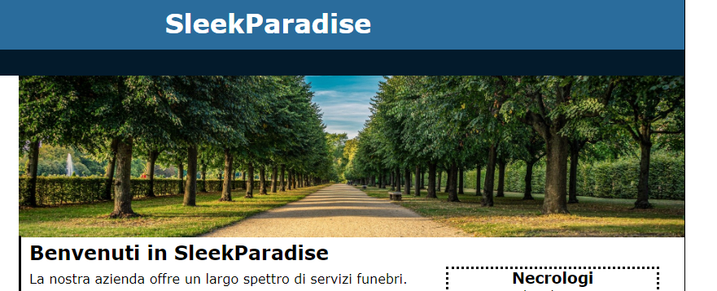
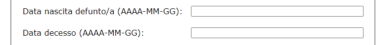
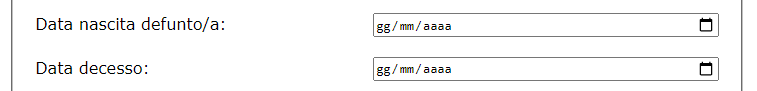
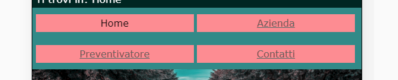
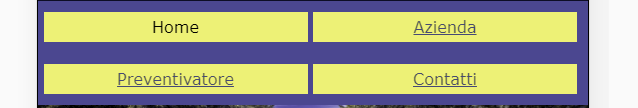

## Analisi codice HTML  
  Per controllare se il sito avesse un HTML valido, si e' deciso di utilizzare lo strumento Total Validator, il quale dopo una scansione di tutte le pagine, ha dato i seguenti risultati:   
  1 Pagina **Home**: valida  
  2 Pagina **Azienda**: valida  
  3 Pagina **Preventivatore**: valida     
  4 Pagina **Contatti**: valida     

  Si e' poi passati ad un controllo manuale per la verifica semantica dei tag HTML, tramite la lettura resa possibile dallo strumento sviluppatore di google chrome. E' risultato che le web pages sono state composte in maniera corretta, in linea generale, tuttavia sono sorte alcune criticita': 

### HOME
L'immagine presente in homepage é stata inserita tramite il tag "img" HTML, tuttavia quest'ultima non é di alcuna importanza per il contenuto della pagina 

 
Questo é l'elemeto in HTML:
``` HTML
<div id="viale">
    
</div>
```
Quest'immagine potrebbe creare confusione ad un eventuale utilizzatore di screen reader, infatti il software leggerebbe una informazione del tutto non necessaria, facendo perdere tempo all'utente.
Sarebbe quindi stato piú opportuno inserire l'immagine direttamente tramite CSS, ottenendo quindi lo stesso risultato ma evitando elementi inutili nel contenuto.
 
### AZIENDA  
  L'immagine raffigurante i componenti dell'azienda, contenuta nella pagina "Azienda" é stata inserita tramite tag HTML in modo errato, infatti il tag "img" compare all'interno di un elemento di tipo paragrafo, tuttavia quest'ultimo non contiene alcun testo, il che non ha senso, dato che si sarebbe potuto inserire l'immagine senza l'ausilio di un tag "p".

  

  ``` HTML
    <p id="noi">
       
    </p>
```

  Abbiamo riscontrato che l'attributo alt é poco significativo, quindi un utente utilizzatore di Screenreader potrebbe non capire quale informazione dovrebbe pervenire da questa immagine. Detto questo pensiamo che sarebbe stato piú opportuna una didascalia che presentasse il personale oppure tramite l'inserimento di un attributo "longdesc".


### PREVENTIVATORE  
Per quanto riguarda la pagina di "preventivazione" notiamo che il form é stato costruito correttamente, tuttavia abbiamo notato, tramite l'ausilio di uno screen reader una criticitá:
Per quanto riguarda i campi di inserimento "Data nascita defunto/a" e "Data decesso" é stato inserito nelle label il formato, in forma scritta, che deve assumere l'input dell'utente.


  ``` HTML
    <div class="linea">
      <label for="decesso">Data decesso (AAAA-MM-GG):</label>
      <input name="decesso" id="decesso" maxlength="10" tabindex="0" value="">
    </div>

   <div class="linea">
      <label for="nomeC">Nome cliente:</label>
      <input name="nomeC" id="nomeC" maxlength="30" tabindex="0" value="">
  </div>
```

Questo rende difficoltoso l'inserimento di una data da parte di un utente che utilizza uno screen reader, sarebbe stato piú opportno inserire un campo di tipo "date", questo avrebbe consentito una maggiore accessibilitá nell'inserimento.

Ecco una eventuale soluzione a questo problema:


  ``` HTML
    <div class="linea">
      <label for="decesso">Data decesso:</label>
      <input type="date" name="decesso" id="decesso" tabindex="0" value="">
    </div>

    <div class="linea">
      <label for="nomeC">Nome cliente:</label>
      <input type="date" name="nomeC" id="nomeC" tabindex="0" value="">
  </div>
    
``` 

### OSSERVAZIONI 
1. Abbiamo notato, trmite la lettura manuale della sorgente che sono stati inseriti dei link alla pagina che sono invisibili:
Questa é un'ottima soluzione per quegli utenti che utilizzano gli screen reader, infatti tramite questi link ("vai al contenuto" e "torna all'inizio") é possibile muoversi agilmente nella pagina "saltando il menu" e leggendo direttamente il contenuto. 
Per quanto riguarda il link "torna all'inizio" sarebbe stata utile la sua visualizzazione direttamente nella pagina Web, probabilmente non é stata inserita per la lunghezza ridotta della pagina. Se le pagine fossero state piú lunghe sarebbe stata necessario vedere il link.

## CSS
Per quanto riguarda il linguaggio di stile abbiamo utilizzato un validatore CSS:
W3C Css validator service, il quale non ha riportato alcun errore in nessuna delle pagine. 
Sono presenti tutte le modalitá di visualizzazione necessaria quali:
- Desktop
- Mobile 
- Stampa

Abbiamo proseguito analizzando la pagina tramite vari filtri per daltonici, grazie allo strumento "Colorblindig" (Estensione per Google Chrome). 
Tramite questa analisi abbiamo osservato che gli utenti affetti da Tritanopia e Deuteranomalia non sono in grado di distinguere i link visitati da quelli non visitati nella versione mobile.
Inoltre, in generale risulta che i link "visitati" nella versione mobile non siano chiari, dato il contrasto non ottimale con lo sfondo.





Il contrasto tra i colori dei testi e dello sfondo, a parte questi due esempi, risulta sempre elevato e quindi corretto.
## Conclusione

Dopo questa analisi si puó notare come il sito in generale sia accessibile, con piccoli cambiamenti é possibile migliorare l'esperienza degli utenti con disabiliá visive.